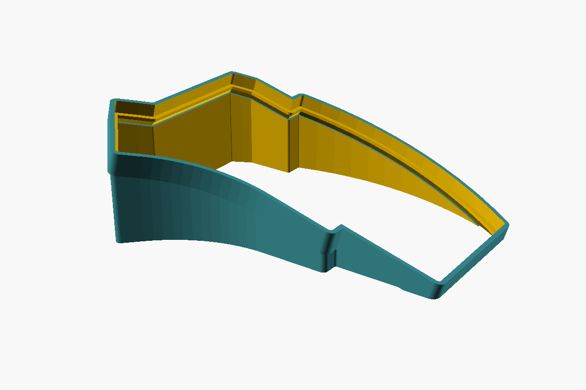
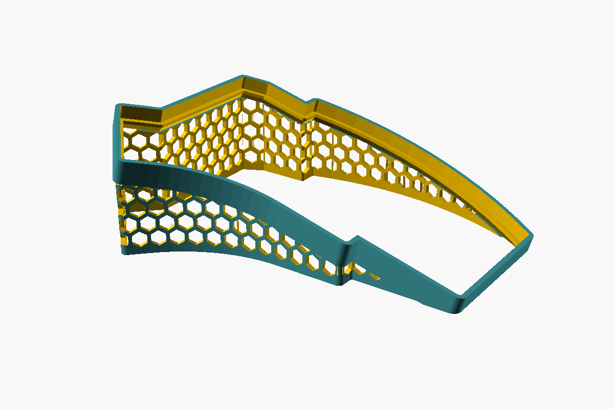
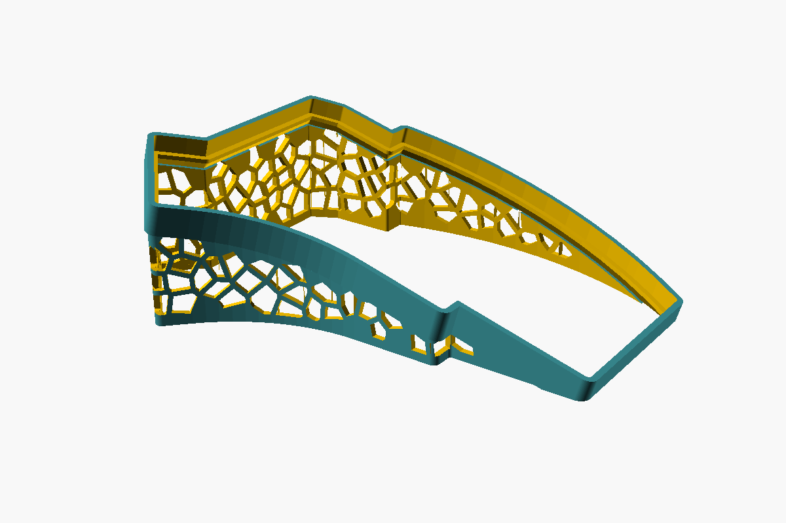

# Kyria tenting stand

Tenting stand for a splitkb Kyria rev3 half, modelled in OpenSCAD from the
official bottom-plate DXF. Two parts in one print:

- A **collar** in the keyboard's own frame: a wall perpendicular to the bottom
  plate, following the case outline, with a small inward ledge the plate rests
  on and a sloped underside below it. It tilts with the keyboard, so the case
  fits exactly at every height of the lip.
- A **pedestal** below it with vertical walls straight down to the desk. Its
  outer face is set in 1 mm so the collar overhangs it as a design line. The
  pedestal carries the optional honeycomb cut-out.

No floor, no bottom. Prints upright with no supports.

| `pattern = "none"` | `pattern = "hex"` | `pattern = "voronoi"` |
| :---: | :---: | :---: |
|  |  |  |

## Files

- `kyria_stand.scad` – the model, all parameters at the top
- `Kyria rev3 Bottom Plate - No Kerf.dxf` – case outline, imported directly
- `kyria_outline.scad` – coarse polyline of the outline, generated; guides the wall pattern
- `dxf2chords.py` – regenerates `kyria_outline.scad` from the DXF (only needed if the DXF changes)
- `build.sh` – renders `kyria_stand_left.stl`, `kyria_stand_right.stl` and PNG previews
- `images/` – the renders above; regenerate with `./render_images.sh`
- `kyria_stand_*.stl` – ready to slice

## Defaults

| parameter       | value  | meaning                                   |
| --------------- | ------ | ----------------------------------------- |
| `inner_height`  | 50 mm  | rim height at the inner (thumb/OLED) edge |
| `lip`           | 6 mm   | collar wall above the plate               |
| `collar_extra`  | 0 mm   | extra collar depth below the ledge chamfer|
| `border`        | 1 mm   | collar overhang beyond the pedestal wall  |
| `wall`          | 2 mm   | wall thickness                            |
| `clearance`     | 0.4 mm | gap between case and pocket wall          |
| `ledge_w`       | 2 mm   | ledge width, inward from the pocket wall  |
| `ledge_t`       | 1.5 mm | ledge thickness                           |
| `chamfer_angle` | 57°    | slope of the ledge underside, vs the plate|
| `pattern`       | "hex"  | wall cut-out: "hex", "voronoi" or "none"  |
| `hex_size`      | 6 mm   | hex: hole width, flat to flat             |
| `hex_strut`     | 1.6 mm | hex: material left between holes          |
| `voronoi_cell`  | 8 mm   | voronoi: mean cell size                   |
| `voronoi_strut` | 1.6 mm | voronoi: material left between cells      |
| `voronoi_jitter`| 0.8    | voronoi: 0 = regular grid, 1 = fully random |
| `voronoi_seed`  | 7      | voronoi: change for a different pattern   |
| `pattern_foot`  | 3 mm   | solid band along the desk                 |
| `pattern_top`   | 1.5 mm | solid margin below the ledge chamfer      |
| `corner_margin` | 0 mm   | solid band either side of a sharp corner; 0 lets holes wrap around corners |

The tent angle follows from `inner_height`, `lip` and `ledge_t`: about 15°
with the defaults. The ledge underside touches the desk at the outer edge, so
the plate bottom sits about 1.5 mm above the desk there; whatever would hang
below the desk is cut off. Collar height is derived, 10.6 mm with the
defaults. Outer rim is about 7 mm tall. Footprint per half: roughly
164 × 119 mm. About 27 cm³ of plastic per half with the hex pattern.

Printed overhang of the ledge underside is `chamfer_angle` minus the tent
angle, measured from horizontal. Keep that at 40° or more.

The pattern is laid out on the "unrolled" wall (distance along the outline
versus height) and cut through each chord of the outline along that chord's
normal, so it flows continuously around the curves. The Voronoi variant seeds
a jittered grid over that plane and wraps it around the loop, so it has no
seam either; seeds stay inside their own grid cell, which keeps cell sizes
even and rules out hairline struts. The holes run up to the
collar, which clips the top row. Neighbouring chords' cutters meet at the
corner's bisector plane, so holes fold around corners without gaps; set
`corner_margin` to a few mm if you'd rather keep the corners solid. The desk
band stays solid.

Keep `ledge_w` at 3 mm or less: the case screw nearest the edge (top inner
corner) is 5.3 mm in, and its head must clear the ledge. If your bottom plate
has rubber feet near the edge, check those too.

`side = "right"` is the DXF as drawn (inner edge on -X, seen from above);
`side = "left"` mirrors it. If the halves come out swapped, just swap the files.

## Rebuild

```bash
./build.sh
```

`PATTERN=voronoi ./build.sh` or `PATTERN=none ./build.sh` picks the wall
pattern without editing the file.

Needs OpenSCAD on the PATH (`brew install --cask openscad@snapshot`) and the
experimental `roof()` feature, which `build.sh` enables with `--enable=roof`.
In the GUI, turn on "roof" under Preferences > Features.

## Printing

Print upright, as modelled. The collar leans with the tent angle, the ledge
underside slopes at 42–72° from horizontal, and the collar overhangs the
pedestal by 1 mm. All of that prints without supports.
